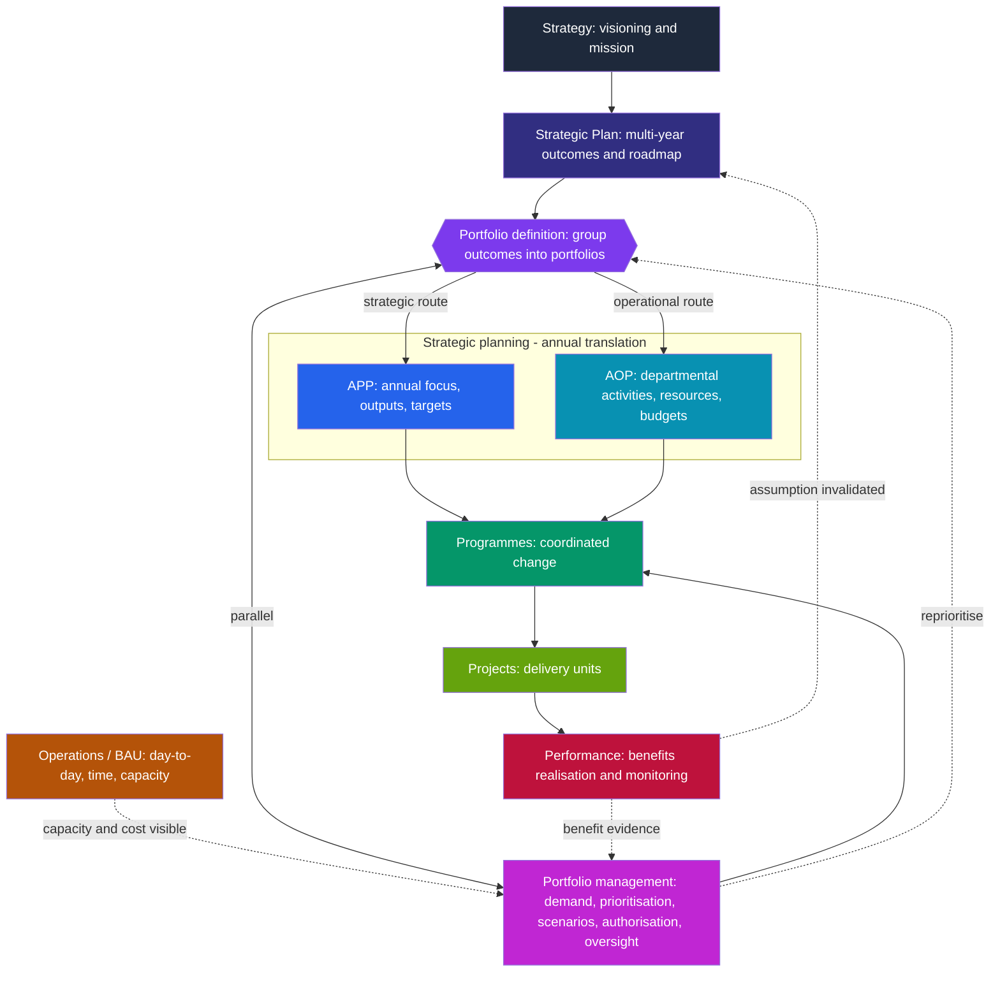

# Framework design: the StratXe planning hierarchy

StratXe planning framework · 16 September 2026

Two decisions shape this hierarchy:

1. **APP and AOP are distinct bands**, not a single merged strategic-planning layer.
2. **Portfolio definition sits directly under SP** (it can begin as soon as strategic outcomes exist), while **portfolio management runs in parallel with** strategic planning rather than above it.

The result is a hierarchy of linked responsibilities with a continuous feedback loop, not a strict containment triangle.

---

## 1. The layers, top to bottom

| Layer | What it is | Owns |
|---|---|---|
| **Strategy** | Direction and intent, visioning and mission. *Strategy ≠ strategic planning.* | The direction being set |
| **Strategic Plan (SP)** | The pathway to the strategy: multi-year (5-year) outcomes and roadmap | Outcomes, the multi-year horizon |
| **Portfolio definition** | Grouping outcomes into portfolios; portfolio roadmap. **Begins as soon as outcomes exist**, does not wait for the full scorecard | Portfolio composition, roadmap, the strategic/operational fork |
| **Strategic planning → APP \| AOP** | Annual translation. **APP** = annual focus/outputs/targets tied to SP outcomes. **AOP** = departmental activities, resources and budgets (operational execution) | Annual commitments (APP); departmental plans and resources (AOP) |
| **Portfolio management** *(parallel to strategic planning)* | The enduring governance/decision layer: demand, prioritisation, scenarios, authorisation, oversight | Investment mix, decisions, backlog |
| **Programme & project management** | Coordinated delivery (programmes) and delivery units (projects) | Delivery of authorised change |
| **Operations management / BAU** | Day-to-day operations, time tracking, resource allocation across ops vs projects | Recurring work and capacity |
| **Performance** | Monitoring what was achieved vs plan; benefits realisation | Results, benefit evidence |

---

## 2. The fork

Portfolio definition triggers a **fork** per outcome/portfolio, strategic or operational:

- **Strategic route** → feeds strategic projects that go back up into strategic decision-making (e.g. ironing out the XE definition), *or* cascades down into the **APP** (one-year focus) → **programmes** (areas of functionality) → **AOP**.
- **Operational route** → goes into the **AOP placeholder**, allocated after APP focus to programmes → operational projects.

Both routes converge on programmes → projects → delivery, then benefits/performance evidence flows back up.

---

## 3. The continuous loop

The framework is not one-directional. The back-and-forth is the point:

- SP → portfolio definition → strategic planning (APP/AOP) → portfolio management → programmes/projects → delivery.
- Delivery and benefit evidence → **up** to portfolio (did the funds achieve the outcome?) → **up** to SP (does the assumption still hold?).
- New demand generated at execution level flows **back up** into the portfolio to be reprioritised.
- APP/AOP commitments and changes **trigger** portfolio review; the portfolio, not the plan, authorises spend.
- Invalidated **strategic assumptions** trigger a strategic review, which is the continuous-diagnostic mechanism the portfolio provides.

---

## 4. Diagram

---

## 5. Design principles behind the hierarchy

- Strategic planning and programme/project management **sit on the same level** because they feed each other; portfolio, programmes and projects cannot stack as one band above the strategic layer.
- **Parallel** (side by side) is not the same as **hierarchy** (SP on top, each band feeding the next). Portfolio management stays parallel to strategic planning while SP remains on top.
- Because SP already contains a **layer of strategic planning** (the multi-year roadmap), portfolio **definition** can start immediately from outcomes, which is why definition is elevated and management is parallel.

---

## 6. Where the strategic-thinking step sits

The **strategic thinking / strategic planning** step belongs **before framework setup** (after diagnosis), so outcomes can be defined and linked to portfolios *before* building the full multi-year scorecard. The diagnostic flow adjusts slightly: define outcomes as goalposts first, then build the scorecard.
