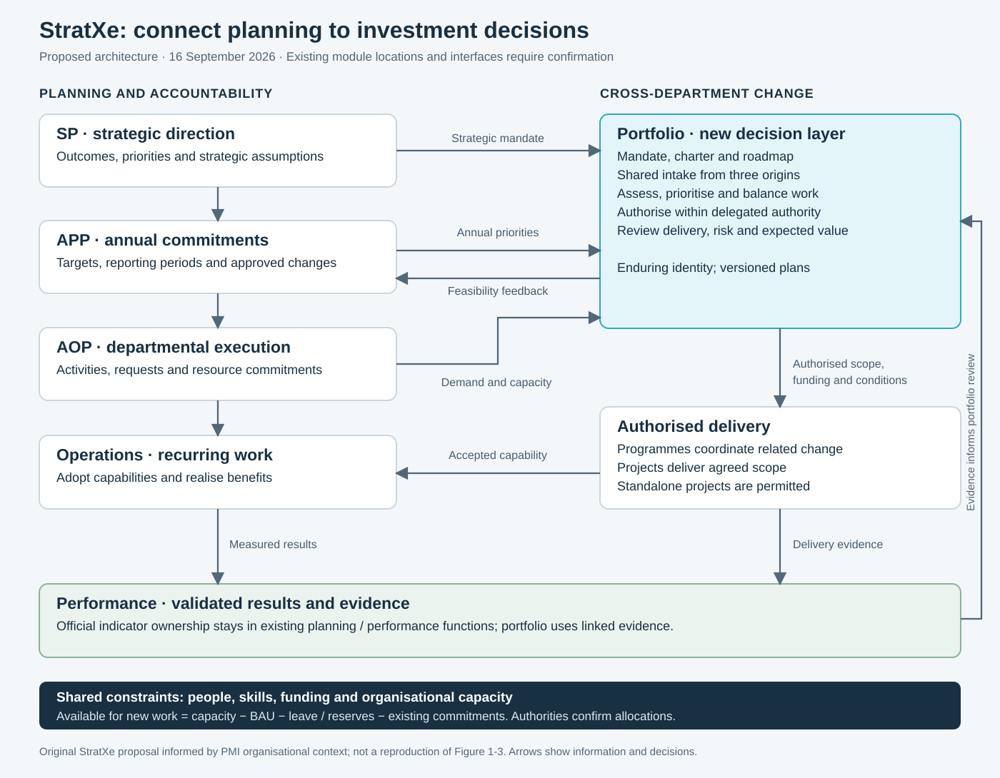
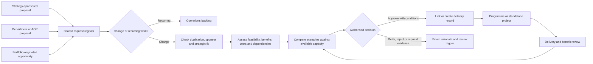

# StratXe: portfolio integration hypothesis

Alignment discussion draft · 16 September 2026

**Proposition:** Extend StratXe with an enduring portfolio decision layer that connects strategic intent to authorised change across departments. Retain SP, APP and AOP as the planning and accountability structure; retain Projects as the delivery workspace. Link the layers through shared records, explicit decision rights and feedback on delivery and value.

This is a proposed operating and information model, not a verified description of StratXe’s production database or interfaces. Evidence reviewed: the supplied screenshot and meeting notes; `index.html`; the linked `prototype.html` and its portfolio, programme and project scripts. The Granola link could not be retrieved, so the supplied notes are the meeting record used here.

## 1. The framework you originally selected

The research index identifies Anthony Boles’ **“The work delivery process: a pragmatic approach to project portfolio management”**, presented at PMI Global Congress in 2009. Its Exhibit 1 is the Enterprise Management Framework. It connects enterprise planning, portfolio planning, portfolio management, work management and operations management. It is an authored conference framework hosted by PMI, distinct from a PMI standard. [Original paper](https://www.pmi.org/learning/library/work-delivery-process-project-portfolio-management-6680).

**Recommendation:** keep it as a completeness check for responsibilities. Do not interpret its boxes as mandatory StratXe modules or a rigid sequence of database parents. Existing modules already cover parts of those responsibilities.

| Framework responsibility | Proposed StratXe home                                                             |
| ------------------------ | --------------------------------------------------------------------------------- |
| Enterprise planning      | Visioning and Strategic Plan, with annual commitments in APP                      |
| Portfolio planning       | New portfolio mandate, charter, investment themes and roadmap                     |
| Portfolio management     | Shared demand, assessment, prioritisation, authorisation and review               |
| Work management          | Programmes for coordinated change; existing Projects for delivery                 |
| Operations management    | Existing Operations/AOP plus relevant finance, resource and performance functions |

The integration problem is therefore **connecting decision responsibilities across the existing structure**, rather than replacing that structure.

## 2. What public and private evidence contributes

These are selected authoritative references and historical cases, not a claim that every organisation in a sector follows one architecture.

| Evidence                                                             | Finding                                                                                                                                                                                                                                   | Proposed implication for StratXe                                                                                                                                                                                                                                                                                                                                            |
| -------------------------------------------------------------------- | ----------------------------------------------------------------------------------------------------------------------------------------------------------------------------------------------------------------------------------------- | --------------------------------------------------------------------------------------------------------------------------------------------------------------------------------------------------------------------------------------------------------------------------------------------------------------------------------------------------------------------------- |
| South African DPME implementation guidance, §§2.3 and 2.8            | APP connects annual outputs and targets to SP outcomes, with forward projections. AOP describes activities and budgets, including operational outputs beyond APP. Budget programmes and implementation programmes are different concepts. | Preserve the planning structure. Link portfolio decisions to its commitments. Store budget classification separately from delivery programme membership. [Guidance](https://www.treasury.gov.za/legislation/pfma/TreasuryInstruction/Guidelines%20for%20Implementation%20of%20the%20Revised%20Framework%20for%20Strategic%20Plans%20and%20Annual%20Performance%20Plans.pdf) |
| UK Government, GovS 002 v2.1 (2025), §§5.1–5.3                       | Portfolio management integrates with business planning, balances change and BAU, and addresses benefits, funds, risks and capacity. It allows sub-portfolios and specifies portfolio leadership.                                          | Add a cross-department decision forum, clear mandates and regular review. Use this as a comparative design reference, not a South African compliance requirement. [Standard](https://projectdelivery.gov.uk/library-products/government-functional-standard-govs-002-project-delivery/)                                                                                     |
| Microsoft Customer Service and Support, Beth Britt case study (2009) | A central strategic portfolio approach supported distributed groups. The case describes shared data and governance, local flexibility, and benefit accountability.                                                                        | Shared investment records can coexist with departmental execution. Keep common fields small enough for departments to maintain. This is historical practice, not evidence of Microsoft’s current architecture. [Case study](https://www.pmi.org/learning/library/2022/02/25/22/01/strategic-portfolio-management-transform-global-organization-6650)                        |
| United Illuminating Company, Shaltry, Drew and Horgan (2002)         | The utility moved from functional project management towards cross-functional portfolio management, incrementally, with finance involvement and funding review gates.                                                                     | Pilot intake, investment decisions and resource commitments before attempting the full module scope. This is a historical implementation example. [Case study](https://www.pmi.org/learning/library/journey-project-portfolio-management-case-study-1070)                                                                                                                   |

**Design inference:** both sectors can use the same core portfolio relationships. Configure the decision criteria, funding classifications, evidence and authority for each organisation. A public-sector configuration might assess service outcomes, equity and mandatory obligations; a commercial configuration might emphasise customer value, margin and growth. Both still need risk, affordability, capacity and benefit evidence. These are proposed configurations, not universal sector rules.

For the first StratXe pilot, use a small number of outcome- or capability-based portfolios where cross-department coordination is needed. Treat geography and department as reporting dimensions unless they genuinely require separate investment authority. Do not create a portfolio merely because a department exists.

## 3. Refine the meeting assumptions before presenting

| Meeting shorthand                         | Wording to use in the proposal                                                                                                                                                              |
| ----------------------------------------- | ------------------------------------------------------------------------------------------------------------------------------------------------------------------------------------------- |
| Portfolio sits parallel to strategy       | It is a connected management layer alongside the planning workflow, **directed by organisational strategy**. Parallel application navigation does not mean independent strategic authority. |
| Portfolio has no fixed end date           | Propose enduring portfolio identities, with dated plans and review cycles. Allow a portfolio to close or be restructured when its mandate ends.                                             |
| APP reprioritises the portfolio           | APP commitments and changes trigger review. The authorised governance body makes the investment decision; a plan does not itself approve expenditure.                                       |
| AOP allocates project resources           | AOP records departmental plans and commitments. Allocation must be confirmed by the relevant resource and financial authorities.                                                            |
| Projects feed portfolio, not strategy     | Portfolio governs selection and balancing. Retain explicit project-to-objective links for traceability and reporting.                                                                       |
| Portfolio manages execution, not outcomes | Portfolio governs the investment mix and uses delivery, value and benefit evidence. SP/APP/AOP/Performance remain authoritative for their approved indicators and results.                  |
| Programmes are combinations of projects   | Use a delivery programme when related projects need joint coordination to realise shared benefits. A folder of unrelated projects is insufficient. A project may have several deliverables. |
| Ongoing operations are outside portfolio  | Keep daily BAU work outside this proposed change workflow, while making its capacity, costs, constraints and benefit evidence visible to portfolio decisions.                               |

APM describes portfolio management in terms of strategic selection, prioritisation and control, balanced against organisational capacity. Its guidance supports looking beyond project status alone. [APM overview](https://www.apm.org.uk/resources/what-is-project-management/what-is-portfolio-management/).

For the XE example, first establish the mandate. An enduring investment domain could be a portfolio; a finite coordinated transformation could be a programme. Knowledge management is a sub-portfolio only if it needs an enduring delegated investment mandate; otherwise consider a programme or project based on the work and benefits.

## 4. Use Figure 1-3 to explain the organisational context

PMI’s Third Edition Figure 1-3 places portfolio management between strategic direction and operations/authorised change, with organisational resources supporting both. It does **not** depict a software menu hierarchy or establish that operations are irrelevant to portfolio management. [Figure 1-3, printed p. 8](https://www.pmi.org/-/media/pmi/documents/public/pdf/certifications/standard-for-portfolio-management-third-edition.pdf#page=20).

Present the original figure already in `assets/pmi-organizational-context.png`, then show this original StratXe application of the idea. Label it **“Proposed StratXe integration model”**, not “PMI Figure 1-3”.

Read the diagram as linked responsibilities, not strict containment. SP directs the portfolio mandate. APP supplies annual commitments and receives feasibility feedback. AOP supplies departmental requests and confirmed resource commitments. Portfolio decisions authorise and coordinate change. Projects deliver; operations adopt; performance evidence informs the next decision.

The screenshot shows Visioning, Strategic Plan, Structure, Operations, Performance and Projects. It does not prove APP and AOP are separate top-level modules or reveal their underlying data relationships. Keep their existing locations until the product owner confirms navigation and ownership.

## 5. Three entry routes, one governed decision process

All three routes use the same minimum record; use proportionate assessment depth. An executive-sponsored request still needs evidence and recorded authority. A portfolio-originated request still needs a sponsor and accountable delivery owner.

Separate permission to investigate from permission to implement. A small discovery allocation can resolve uncertainty before a full investment decision. Emergency and mandatory work need a defined expedited route and visible trade-offs; they should not disappear from capacity planning.

## 6. What the portfolio elements incorporate

The following are **proposed StratXe requirements**. They translate the discussion into reviewable records and actions.

| Element                              | Minimum content in StratXe                                                                                                                  | Control or output                                                                |
| ------------------------------------ | ------------------------------------------------------------------------------------------------------------------------------------------- | -------------------------------------------------------------------------------- |
| Portfolio strategic plan             | Linked SP outcomes and versions; investment thesis; scope; strategic themes; planning horizon; assumptions; indicative funding and capacity | Sponsor endorses the mandate and success criteria                                |
| Portfolio charter                    | Stable portfolio ID; sponsor; manager; forum; decision rights; boundaries; escalation thresholds; review date                               | Approved authority to operate the portfolio                                      |
| Portfolio roadmap                    | Existing and proposed components; intended capabilities; milestones; dependencies; benefit dates; funding windows                           | Versioned multi-year view, with proposed versus approved work distinct           |
| Portfolio management plan            | Intake policy; assessment criteria; scoring versions; approval gates; review cadence; risk, information and communication controls          | Agreed rules for managing the portfolio                                          |
| Portfolio definition                 | Inventory of candidate and existing work; classifications; strategic links; duplicate checks; accountable owners                            | Reconciled composition with explicit candidate/active/paused/closed status       |
| Optimisation                         | Alternative investment mixes; mandatory commitments; dependencies; capacity by skill and period; affordability; benefit and risk trade-offs | Recommended scenario with rationale and rejected alternatives                    |
| Authorisation                        | Decision authority; date; scope or tranche; funding ceiling; resource commitments; conditions; affected versions                            | Recorded decision; implementation starts only when applicable conditions are met |
| Oversight                            | Exceptions; forecast changes; risk exposure; decisions due; stale evidence; compliance with conditions                                      | Continue, correct, resequence, pause or stop decisions                           |
| Performance, supply/demand and value | Portfolio measures; BAU reservations; committed and proposed demand; benefit owner; baseline; forecast; actual evidence                     | Feasible commitments and evidence for continued investment                       |

**Correct the source numbering.** In the cited PMI Third Edition: 4.1 strategic plan; 4.2 charter; 4.3 roadmap; 5.1 management plan; 5.2 define; **5.3 optimise; 5.4 authorise; 5.5 oversight**. Sections **6.1–6.3** concern performance planning, supply/demand and value. **7.1–7.2** concern communication planning and information. APP/AOP are local integration inputs, not PMI process names. [Contents, Third Edition](https://www.pmi.org/-/media/pmi/documents/public/pdf/certifications/standard-for-portfolio-management-third-edition.pdf#page=7).

## 7. The interfaces that make this an integration

| Existing responsibility        | Information supplied to Portfolio                                     | Information returned from Portfolio                                                          |
| ------------------------------ | --------------------------------------------------------------------- | -------------------------------------------------------------------------------------------- |
| Visioning / SP                 | Outcome IDs, approved strategic direction, strategy version           | Coverage, investment contribution, gaps and feasibility feedback                             |
| APP                            | Indicator and target IDs, reporting periods, approved changes         | Proposed execution mix, delivery confidence, target implications requiring planning approval |
| Structure                      | Departments, accountable roles, reporting relationships               | Cross-department participation linked to the same work                                       |
| Operations / AOP               | Requests, BAU workload, local commitments and delivery constraints    | Approved work, requested allocations and coordination decisions                              |
| Projects / Programmes          | IDs, forecasts, dependencies, risks, milestones and handover evidence | Authorised scope/funding, conditions, strategic links and approved changes                   |
| Performance                    | Validated indicator results, measurement dates and evidence           | Benefit contribution links, forecasts and exceptions requiring review                        |
| Finance / resource authorities | Approved funding, actuals and confirmed availability                  | Proposed allocations and changes for authorised confirmation                                 |

The last row is a responsibility to locate during technical discovery; the screenshot does not establish a separate finance system or resource API.

Proposed information rules:

1. **One canonical project record.** AOP, programme and portfolio screens reference it; they do not create copies for each department.
2. **Separate identity from plans.** A portfolio persists while its annual plan, roadmap and strategy mappings are versioned. Year-end creates a new planning version, not a cloned portfolio and project inventory.
3. **Separate organisational ownership from investment grouping.** Record one accountable sponsor and delivery lead, plus multiple contributing departments and allocation lines.
4. **Permit standalone projects.** Programme membership is optional. For the pilot, assign one primary portfolio for accountability; allow additional strategic contribution links without duplicating cost or benefit totals.
5. **Use many-to-many strategic links.** A project can contribute to several objectives; preserve the relevant strategy and indicator versions. A direct strategic link complements portfolio governance.
6. **Keep finance and indicators authoritative.** Portfolio financials aggregate the accepted finance records. Portfolio benefit views reference validated results; they may hold distinct benefit forecasts and review decisions.
7. **Separate budget programmes from delivery programmes.** Connect them through funding and classification links; do not make them the same entity.
8. **Record decisions durably.** Store actor, authority, date, rationale, conditions, affected records and prior/new versions. Navigation or a success notification is not evidence of an integration.

Do not calculate organisational performance by averaging project completion percentages. A finished project is delivery evidence; an outcome still needs its agreed measure and validation. Likewise, do not add programme totals to their constituent project costs in the same portfolio total.

## 8. Demonstrate the tender-screening example

Use this as the alignment-session story; labels and quantities are illustrative.

1. Three departments submit requests to improve tender screening. The request register retains all three origins and identifies overlapping scope.
2. Portfolio triage tests whether one common capability would serve them. The decision could be one shared project or, if coordinated projects and benefits justify it, a programme.
3. A sponsor and benefit owner are assigned. The record links to the relevant SP outcome and APP target where applicable; no target is invented simply to fill a field.
4. Resource owners confirm specialist availability after BAU and existing commitments. With 100 days of gross capacity, 20 days BAU, 10 leave/other reservations and 50 already committed, only **20 days** remain for new work. The meeting’s 20% BAU was an example, not a default policy.
5. The forum compares phased delivery, extra capacity and deferral. Finance confirms affordability; the authorised decision and conditions are recorded.
6. One project record appears in Projects and in each contributing department’s AOP view. Departmental allocation lines show who supplies what.
7. A delay triggers a portfolio review of dependencies and target implications. The portfolio manager cannot silently rewrite an approved APP target.
8. Operations accepts the capability. Daily tender reviews remain BAU; validated screening-time evidence supports performance reporting and a later benefit review.

## 9. How to use and improve the existing prototype

The research index links to `prototype.html`. That file loads `ppmis-consolidated.js`, `program-module.js` and `project-module.js`; `prototype.rebuild-v1.html` is a separate version, not the index’s linked target.

The linked portfolio script already exposes Overview, Portfolio plans, Demand, Roadmaps, Investments, Resources, Financials and Benefits. It contains illustrative programme/project roll-ups, decision screens and navigation to other modules. This is a useful presentation foundation.

However, the reviewed script contains fixed demonstration records and several actions that display notifications. Its `decide()` function changes request status in memory and displays a message about a decision trail; that function does not itself persist the claimed trail. Treat these as interface demonstrations, not proof of working cross-module integration.

| Prototype area            | What the integration presentation should demonstrate                                          |
| ------------------------- | --------------------------------------------------------------------------------------------- |
| Portfolio plans           | Enduring portfolio identity plus separately dated plan; charter authority; linked SP outcomes |
| Demand                    | Three origins, BAU triage, duplicate detection and sponsor assignment                         |
| Roadmaps / Investments    | Shared project IDs, optional programme membership, departments and dependencies               |
| Resources / Financials    | BAU reservations, existing commitments, proposed demand and confirmed allocations             |
| Approvals                 | A decision changes authorised work and produces a visible decision record with conditions     |
| Benefits                  | Forecast benefit versus validated actual result, with owner and evidence source               |
| SP / APP / AOP / Projects | Open the same linked investment from each relevant context                                    |

Present one connected tender-screening story rather than touring every feature. Show existing context, the new decision capability, and the specific record exchanged at each boundary. Mark simulated handoffs clearly.

## 10. Implementation sequence and acceptance evidence

| Stage                        | Scope                                                                                                         | Evidence required before broadening scope                                                                                                       |
| ---------------------------- | ------------------------------------------------------------------------------------------------------------- | ----------------------------------------------------------------------------------------------------------------------------------------------- |
| 1. Confirm the contract      | Agree owners, mandates, approval thresholds, portfolio boundaries, source records and actual module locations | A mapped sample SP outcome, APP target, AOP activity and project; agreed authority for cross-department decisions                               |
| 2. Pilot the shared register | Portfolio identity, strategic links, three-route intake, triage and existing-project import                   | Duplicate departmental requests can be reconciled without losing their origins; existing projects are linked without resetting approval history |
| 3. Authorise and hand off    | Proportionate assessment, simple capacity check, funding confirmation, decision record and delivery link      | One approval produces or links one delivery record; blocked conditions prevent unauthorised implementation                                      |
| 4. Close the review loop     | Project forecasts, operational acceptance, validated performance evidence and benefit review                  | A delivery exception prompts a traceable portfolio decision; closed projects retain post-delivery benefit ownership                             |
| 5. Extend planning depth     | Cross-portfolio scenarios, multi-year envelopes and richer dependencies                                       | Totals reconcile without duplicated spend or benefits; annual rollover preserves work identity and historical decisions                         |

Start with one portfolio and a small set of real work, including a cross-department request, an existing project and a recurring BAU item. Use quarterly or other agreed reviews plus event-triggered reviews; do not wait for the annual APP cycle to address a serious capacity or value change.

## 11. Decisions for the alignment session

- Confirm the two connected layers and which existing modules own APP/AOP records.
- Choose the first portfolio’s mandate and accountable sponsor; confirm whether XE is an enduring domain or a finite transformation.
- Agree who can approve, stop or resequence work across departments, and who confirms resources and funding.
- Agree the boundary between official performance results and portfolio benefit forecasts/reviews.
- Confirm the prototype’s first end-to-end story and mark each handoff as implemented, simulated or proposed.

Suggested opening statement:

> “The research points us towards adding portfolio decision-making to StratXe’s existing planning structure. SP sets direction, APP expresses annual commitments and AOP organises departmental execution. Portfolio connects those commitments to a feasible mix of cross-department programmes and projects. The integration is made visible through shared work records, authorised resource commitments and feedback from delivery and performance.”

The hypothesis is supported if the pilot can make and trace one cross-department investment decision without duplicating projects, conflicting with departmental authority, or creating a second set of official performance figures.
